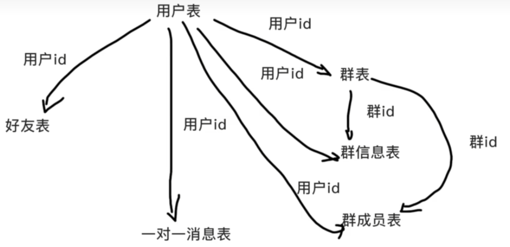

## 作用
备忘录

## dao
封装对数据库的访问操作

## table
### 用户表
1. Id
2. 用户名
3. 邮箱
4. 性别
5. 生日
6. 电话
7. 密码
8. 注册时间
9. 签名
10. 头像链接

### 好友表
1. Id
2. 用户 Id
3. 好友 Id
4. 生成时间
5. 好友状态(0 表示申请中, 1 表示已为好友, 2 表示申请发送方, 对方还未同意)

### 群信息表
1. Id
2. 群主 Id
3. 群名
4. 群封面链接
5. 群公告
6. 群建立时间

### 群成员表
1. Id
2. 群 Id
3. 用户 Id
4. 群内名
5. 加入时间,
6. 未读消息数,
7. 是否屏蔽群消息(0 不屏蔽, 1 屏蔽)

### 群消息表
1. Id,
2. 群 Id
3. 发送者 Id
4. 发送内容
5. 内容类型(0 文字, 1 图片链接, 2 音频链接…)
6. 发送时间

### 一对一信息表
1. Id
2. 发送者 Id
3. 接收者 Id
4. 发送内容
5. 内容类型(0 文字, 1 图片链接, 2 音频链接),
6. 发送时间
7. 消息状态(0 已读, 1 未读)

### 表关系


&nbsp;&nbsp;

## 接口文档
### 注册
**接口功能**:用于用户的注册
**接口地址**：/users
**请求方式**：POST
**参数类型**: JSON
**请求参数**：

```json
{
  "name": "string", // 必填，唯一
  "pwd": "string", // 必填
  "email": "string" // 必填，唯一
}
```

**响应参数**：

```json
{
  "statusCode": "number" // 状态码
}
```

&nbsp;

### 用户名/邮箱匹配
**接口功能**: 用户名/邮箱数据库匹配
**接口地址**：/users/check/:usernameOrEmail
**请求方式**：GET
**参数类型**: JSON
**请求参数**：

```json
{
  "usernameOrEmail": "string" // name/email
}
```

**响应参数**：

```json
{
  "statusCode": "number", // 状态码
  "occupied": "boolean" // false 不存在 true 存在
}
```

&nbsp;

### 登录
**接口功能**: 验证用户登录
**接口地址**：/users/login
**请求方式**：POST
**参数类型**: JSON
**请求参数**：

```json
{
  "data": "string", // 必填 name/email
  "pwd": "string" // 必填
}
```

**响应参数**：

```json
{
  "statusCode": "number", // 状态码
  "result": {
    "name": "string",
    "imgurl": "string",
    "token": "string"
  }
}
```

&nbsp;

### 用户搜索

**接口功能**: 返回用户在搜索页中需要查询的数据
**接口地址**：/users/:userId
**请求方式**：POST
**参数类型**: JSON
**请求参数**：

```json
{
  "data": "string", // 必填 name/email
  "token": "string"
}
```

**响应参数**：

```json
{
  "statusCode": "number", // 状态码
  "result": {
    "Id": "string",
    "name": "string",
    "imgurl": "string"
  }
}
```

&nbsp;

### 判断是否为好友

**接口功能**: 返回用户在搜索页中需要查询的数据中与用户的关系
**接口地址**：/search/isFriend
**请求方式**：POST
**参数类型**: JSON
**请求参数**：

```json
{
  "uId": "string", // 必填
  "fId": "string" // 必填
}
```

**响应参数**：

```json
{
  "statusCode": "number" // 状态码
}
```

&nbsp;

### 搜索群

**接口功能**: 返回用户在搜索页中需要查询的数据
**接口地址**：/search/group
**请求方式**：POST
**参数类型**: JSON
**请求参数**：

```json
{
  "data": "string" // 必填
}
```

**响应参数**：

```json
{
  "statusCode": "number", // 状态码
  "result": {
    "Id": "string",
    "name": "string",
    "imgurl": "string"
  }
}
```

&nbsp;

### 判断是否在群里

**接口功能**: 返回用户在搜索页中需要查询的数据
**接口地址**：/search/group
**请求方式**：POST
**参数类型**: JSON
**请求参数**：

```json
{
  "uId": "string", // 必填
  "gId": "string" // 必填
}
```

**响应参数**：

```json
{
  "statusCode": "number" // 状态码
}
```

&nbsp;

### 用户详情

**接口功能**: 返回用户的详细数据
**接口地址**：/user/detail
**请求方式**：POST
**参数类型**: JSON
**请求参数**：

```json
{
  "Id": "string" // 必填
}
```

**响应参数**：

```json
{
  "statusCode": "number", // 状态码
  "result": {
    "Id": "string",
    "name": "string",
    "imgurl": "string",
    "sex": "string",
    "phone": "string",
    "explain": "string",
    "time": "date",
    "birthday": "date"
  }
}
```

&nbsp;

### 用户详情修改

**接口功能**: 修改用户的详细数据
**接口地址**：/user/update
**请求方式**：POST
**参数类型**: JSON
**请求参数**：

```json
{
  "Id": "string", // 必填
  "data": "string", // 修改内容
  "type": "string", // 修改类型
  "pwd": "string", // 原密码
  "token": "string"
}
```

**响应参数**：

```json
{
  "statusCode": "number" // 状态码
}
```

&nbsp;

### 修改好友昵称

**接口功能**: 修改用户详情的好友昵称
**接口地址**：/user/markname
**请求方式**：POST
**参数类型**: JSON
**请求参数**：

```json
{
  "uId": "string",
  "fId": "string",
  "token": "string"
}
```

**响应参数**：

```json
{
  "statusCode": "number" // 状态码
}
```

&nbsp;

### 获取好友昵称

**接口功能**: 获取用户详情的好友昵称
**接口地址**：/user/getFriendName
**请求方式**：POST
**参数类型**: JSON
**请求参数**：

```json
{
  "uId": "string",
  "fId": "string",
  "token": "string"
}
```

**响应参数**：

```json
{
  "statusCode": "number", // 状态码
  "result": "object" //
}
```

&nbsp;

### 好友申请

**接口功能**: 好友申请
**接口地址**：/friend/applyFriend
**请求方式**：POST
**参数类型**: JSON
**请求参数**：

```json
{
  "uId": "string",
  "fId": "string",
  "msg": "string", // 请求词
  "token": "string"
}
```

**响应参数**：

```json
{
  "statusCode": "number" // 状态码
}
```

&nbsp;

### 好友状态修改

**接口功能**: 好友申请的状态修改，好友通过
**接口地址**：/friend/updateFriendState
**请求方式**：POST
**参数类型**: JSON
**请求参数**：

```json
{
  "uId": "string",
  "fId": "string",
  "token": "string"
}
```

**响应参数**：

```json
{
  "statusCode": "number" // 状态码
}
```

&nbsp;

### 好友删除或拒绝

**接口功能**: 好友删除或拒绝
**接口地址**：/friend/delFriend
**请求方式**：POST
**参数类型**: JSON
**请求参数**：

```json
{
  "uId": "string",
  "fId": "string",
  "token": "string"
}
```

**响应参数**：

```json
{
  "statusCode": "number" // 状态码
}
```

&nbsp;

### 文件上传

**接口功能**: 图片等<20M 文件上传
**接口地址**：/files/upload
**请求方式**：POST
**参数类型**: JSON
**请求参数**：

```json
{
  "url": "string",
  "Name": "string",
  "token": "string"
}
```

**响应参数**：

```json
{
  "filename": "string" // 状态码
}
```

&nbsp;

### 获取好友列表

**接口功能**: 在首页获取好友列表
**接口地址**：/index/getFriendList
**请求方式**：POST
**参数类型**: JSON
**请求参数**：

```json
{
  "uId": "string",
  "state": "string",
  "token": "string"
}
```

**响应参数**：

```json
{
  "statusCode": "number", // 状态码
  "result": {
    "id": "string",
    "name": "string",
    "markname": "string",
    "imgurl": "string",
    "lastTime": "date"
  }
}
```

&nbsp;

### 获得最后一条信息

**接口功能**: 获得好友的最后一条信息
**接口地址**：/index/getLastMsg
**请求方式**：POST
**参数类型**: JSON
**请求参数**：

```json
{
  "uId": "string",
  "fId": "string"
}
```

**响应参数**：

```json
{
  "statusCode": "number", // 状态码
  "result": {
    "message": "string",
    "time": "date",
    "types": "number"
  }
}
```

&nbsp;

### 未读信息数

**接口功能**: 好友的未读信息数
**接口地址**：/index/getUnreadMsg
**请求方式**：POST
**参数类型**: JSON
**请求参数**：

```json
{
  "uId": "string",
  "fId": "string"
}
```

**响应参数**：

```json
{
  "statusCode": "number", // 状态码
  "result": "number"
}
```

&nbsp;

### 变更为已读

**接口功能**: 好友的未读信息数变更为已读
**接口地址**：/index/updateMsgState
**请求方式**：POST
**参数类型**: JSON
**请求参数**：

```json
{
  "uId": "string",
  "fId": "string"
}
```

**响应参数**：

```json
{
  "statusCode": "number", // 状态码
  "result": {
    "gId": "string",
    "name": "string",
    "markname": "string",
    "imgurl": "string",
    "lastTime": "date",
    "tip": "number"
  }
}
```

&nbsp;

### 获取群消息

**接口功能**: 获取群消息
**接口地址**：/index/getGroupMsg
**请求方式**：POST
**参数类型**: JSON
**请求参数**：

```json
{
  "gId": "string"
}
```

**响应参数**：

```json
{
  "statusCode": "number", // 状态码
  "result": {
    "message": "string",
    "time": "date",
    "types": "number",
    "name": "string"
  }
}
```

&nbsp;

### 变更群信息为已读

**接口功能**: 变更群信息为已读
**接口地址**：/index/updateGroupMsgState
**请求方式**：POST
**参数类型**: JSON
**请求参数**：

```json
{
  "gId": "string",
  "uId": "string"
}
```

**响应参数**：

```json
{
  "statusCode": "number" // 状态码
}
```

&nbsp;

### 获取群列表

**接口功能**: 获取群列表
**接口地址**：/index/getGroupList
**请求方式**: POST
**参数类型**: JSON
**请求参数**：

```json
{
  "uId": "string"
}
```

**响应参数**：

```json
{
  "statusCode": "number" // 状态码
}
```

&nbsp;

&nbsp;
&nbsp;

## 处理和备忘
### 规范
#### 状态码
**404**：未找到请求的资源。在用户不存在的情况下，应该返回 404 状态码。
**400**: 客户端发送了无效的请求，例如密码不匹配任何用户的情况。
**200**: 在验证通过且返回用户信息和 token 的情况下，应该返回 200 状态码。
**409**: 冲突或资源已存在。

res.status(200).send() 适用于成功请求和返回数据的情况。
res.status(409).json() 适用于冲突或资源已存在的情况下返回错误信息。
&nbsp;

### 前端到后端的读取数据过程

1. 前端发送请求 -> 由后端路由接收 -> 服务层函数进行一些初步的处理或校验 -> dbserver 调用数据库操作函数 -> 数据库
2. 数据库 -> 将结果返回到 dbserver -> dbserver 将结果返回前端
3. 如果不需要数据库操作则从服务层函数返回结果到前端
   &nbsp;

### 匹配用户名/邮箱

前端字段->数据库结果 > 0

&nbsp;

### 注册密码加密 bcrypt.js

bcrypt.js 是生成哈希 api，在服务层进行调用。

&nbsp;

### token

当第一次登录后，服务器生成一个 Token，并将 Token 返回给客户端，以后客户端只需带上这个 Token 前来请求数据即可，无需再次带上用户名和密码。

&nbsp;

### 登录流程
1. app 携带用户名和密码发起请求
2. 在 dbserver 验证身份生成 token
3. 返回 JWT 信息
4. app 携带 token，请求获取用户资料
5. 服务器验证 token
6. 服务器返回该用户的用户资料

&nbsp;


### 登录
接口1 接口2 接口3 ...
请求失败403
  1. 登录过期->重新登录
  2. 会话过期->重新刷新token->新token->重新请求以上失败接口

### token 判断

**作用**：避免用户绕过验证
jwt.js
access token（访问令牌）
* 在应用中进行身份验证和操作
* 有效期 15 分钟

refresh token（刷新令牌）
* 用于在Access Token过期后获取一个新的Access Token
* 有效期 7 天

* 用户第一次登录：
    1. 后端生成 access token 和 refresh token，发送到前端
    2. 前端将 access token 存储在 HTTP-only 的 cookies，将 refresh token 存储在 localStorage。
* 用户在应用中
    1. 每一个的请求必须携带访问令牌，在后端app.js中检查是否携带有效的访问令牌，如果无效响应401，前端则提示提示用户后重定向页面到登录。
* 用户登出
  1. 前端清除存储的 access token 和 refresh token。
  2. 重定向到登录页面
* 用户退出应用后在进入
  1. 检查 localStorage 中是否存在刷新令牌。（这一步对不对？又在哪里做？）
  2. 存在，直接使用refresh token获取新的access token，并定向到主页面。
  3. 如果不存在，则提示用户重新登录。

问题在于：
    1. 访问令牌过期后如何自动获取新令牌并重复请求，而不是重定向页面。
        当访问令牌过期时（即收到401响应），你可以使用refresh token来获取新的access token。

    2. 用户在应用内，可能面临刷新令牌过期问题，如果实现刷新令牌的自动刷新。
        在应用的入口文件设置一个定时器，间隔刷新刷新令牌的有效期。


在 app.js 作判断

&nbsp;

### 好友申请
- 排序难点
  好友列表排序：根据每个好友最后一条通讯消息的时间来排序，越早的时间排在前面。
  在好友表和群成员表中添加 lastTime，表示为最后一条聊天信息的时间，每一次发送信息都进行一个更新。

- 好友申请难点
  双向好友关系:
  会创建两条记录：一条记录中 A 是 userId，B 是 friendId，另一条记录中 B 是 userId，A 是 friendId。

applyFriend 是申请好友操作，它会执行两次 buildFriend，将这两条数据插入好友表
因此：好友申请流程是申请后建立一对一的好友状态，判断是否为初次或者多次申请

好友申请处理：当用户申请成为好友时，需要判断是否已经存在好友关系，如果不存在则创建，如果已存在则更新最后通讯时间，并且插入一条申请消息。

&nbsp;

### 文件上传
涉及用户头像、群头像、聊天的文件上传
multer 中间件 控制文件存储
files.js 处理文件操作的路由、mkdir.js 动态创建文件
将上传的文件到 data

处理文件大小

```nodejs
limits: { fileSize: 1024 * 1024 * 20 }
```

获取静态路径

```nodejs
app.use(express.static(__dirname + "/data"));
```

### 文件上传
涉及用户头像、群头像、聊天的文件上传
multer 中间件 控制文件存储
files.js 处理文件操作的路由、mkdir.js 动态创建文件
将上传的文件到 data

处理文件大小

```nodejs
limits: { fileSize: 1024 * 1024 * 20 }
```

获取静态路径

```nodejs
app.use(express.static(__dirname + "/data"));
```
&nbsp;

### socket.io


multer 中间件 控制文件存储
files.js 处理文件操作的路由、mkdir.js 动态创建文件
将上传的文件到 data

处理文件大小

```nodejs
limits: { fileSize: 1024 * 1024 * 20 }
```

获取静态路径

```nodejs
app.use(express.static(__dirname + "/data"));
```
&nbsp;


### 主页页面
#### 未读消息
uId 和 fId 的 state

&nbsp;

### 用户页面
- 访问状态
  - 用户访问
  - 好友访问
  - 非好友访问

**解析文件**：使用

&nbsp;
&nbsp;

## 包

### nodemailer

**作用**：在 node 中收发电子邮件。SMTP 是一种 TCP 协议，支持电子邮件传输的应用层协议。

### body-parser

使用 Express 4.16.0 json，放弃 body-parser，一定确保在正确位置。

### bcrypt

**作用**：明文加密
**npm**；npm install bcryptjs

### jsonwebtoken

**作用**：JWT 是跨域认证解决方案，JWT 的声明一般被用来在身份提供者和服务提供者间传递被认证的用户身份信息。
**npm**：npm install jsonwebtoken
